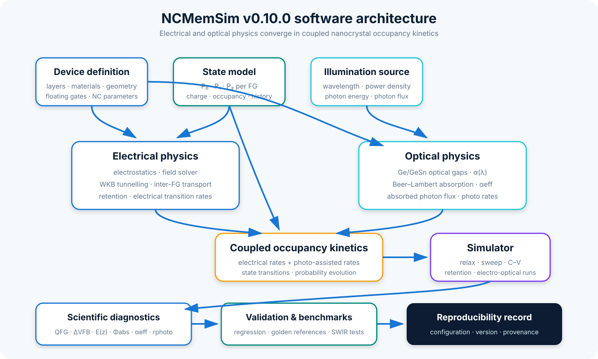

<p align="center">
  
</p>

# NCMemSim

**Nanocrystal Memory Simulation Platform**

NCMemSim is a modular Python framework for the simulation and design–technology co-optimization (DTCO) of Ge/GeSn nanocrystal non-volatile memories. It provides an explicit multilayer device description, independent state variables for one to three floating gates, compact electrostatics, local field reconstruction, WKB-based tunnelling, inter-floating-gate charge redistribution, retention analysis, wavelength-dependent Ge/GeSn optical absorption, photo-assisted programming, validation utilities, reproducibility manifests, and deterministic regression references.

> **Current release:** `0.10.0` — Optical Programming
> **Scientific status:** research software under active development; Phase D electrical/retention physics and Phase E optical-programming capabilities are implemented and covered by automated validation.

## Why NCMemSim?

Distributed floating-gate memories couple material composition, nanocrystal geometry, dielectric-stack design, local electrostatics, tunnelling barriers, charge-state kinetics, retention, and optical excitation. NCMemSim separates these concerns into testable modules so that a device can be explored reproducibly instead of being hard-coded into one monolithic script.

The framework is intended for:

- Ge and GeSn nanocrystal floating gates;
- one-, two-, and three-floating-gate stacks;
- HfO2/SiO2 dielectric architectures;
- compact C–V and memory-window studies;
- local electric-field and potential analysis;
- WKB tunnelling and inter-FG transport;
- retention and charge-redistribution studies;
- wavelength-dependent optical and electro-optical programming studies;
- SWIR response studies for Ge/GeSn nanocrystal floating gates;
- future experimental fitting, uncertainty-aware calibration, and design-space exploration.

## Implemented capabilities

| Area | Available in v0.10.0 |
|---|---|
| Device construction | V1 and V2 architectures, 1–3 floating gates |
| Materials | Si, SiO2, HfO2, Ge, composition-dependent GeSn |
| State model | Independent `P0`, `P1`, `P2` arrays for each FG |
| Electrostatics | Compact coupling and flat-band shift decomposition |
| Local fields | 1D potential and electric-field profiles |
| Tunnelling | WKB-based tunnelling engine |
| Transport | Nearest-neighbour FG↔FG tunnel network |
| Retention | Adaptive time integration with logarithmic outputs |
| Optical sources | Monochromatic wavelength and power-density sources |
| Optical materials | Compact Ge/GeSn direct, indirect, and Urbach absorption |
| Optical absorption | Beer–Lambert absorption and absorbed photon flux |
| Photo-assisted kinetics | Configurable photo-assisted 0→1 and 1→2 transitions |
| Electro-optical programming | Electrical and optical transition-rate coupling |
| Optical diagnostics | Per-FG absorption, photon flux, and photo-transition rates |
| SWIR validation | Wavelength sweeps and programming-voltage-reduction benchmarks |
| Validation | Probability, device, field, charge-conservation, optical, and kinetic checks |
| Reproducibility | Device/simulation hashes and runtime manifest |
| Regression | Golden reference suite and benchmark utilities |

Experimental parameter fitting, automated DTCO, and advanced quantum corrections remain roadmap items. Optical programming is implemented in v0.10.0 using a compact model whose absolute absorption amplitudes and photo-capture efficiencies remain provisional unless independently calibrated.

## Installation

NCMemSim requires Python 3.11 or newer. The current CI matrix covers Python 3.11, 3.12, and 3.13.

```bash
python -m venv .venv
```

Activate the environment, then install the project from the repository root:

```bash
python -m pip install --upgrade pip
python -m pip install -e .
```

For development tools:

```bash
python -m pip install -e ".[dev]"
```

Verify the installation with:

```bash
python -c "import ncmemsim; print(ncmemsim.__version__)"
```

For this release, the expected version is:

```text
0.10.0
```

## Quick start

The following example builds a three-FG V2 device, assigns an initial programmed state, and runs a retention simulation:

```python
from ncmemsim import DeviceBuilder, DeviceState, RetentionConfig, Simulator

# Gate / SiO2 / (FG / tunnel SiO2)^3 / Si
device = DeviceBuilder.v2(
    n_fgs=3,
    control_sio2_nm=25.0,
    inter_fg_sio2_nm=1.5,
    tunnel_sio2_nm=7.0,
)

state = DeviceState.empty_for_device(device)
for fg_state, occupation in zip(
    state.floating_gates,
    (0.75, 0.45, 0.20),
):
    fg_state.P0[:] = 1.0 - occupation
    fg_state.P1[:] = occupation
    fg_state.P2[:] = 0.0

result = Simulator(device).simulate_retention(
    state,
    RetentionConfig(
        total_time_s=1.0e4,
        initial_dt_s=1.0e-6,
        maximum_dt_s=100.0,
        output_points=61,
    ),
)

print(result.qfg_C_m2[-1])
print(result.mean_occupation_by_fg[-1])
print(result.total_charge_retention_fraction)
```

See [`docs/quickstart.md`](docs/quickstart.md) and the executable files in [`examples/`](examples/) for electrostatic coupling, local fields, transport, retention, validation, material-model, and optical-programming workflows.

The Phase E examples include:

- `examples/e6a_swir_wavelength_sweep.py` — wavelength-dependent Ge/GeSn optical response;
- `examples/e6d_swir_voltage_reduction.py` — compact SWIR-assisted programming-voltage-reduction benchmark.

## Package architecture

<p align="center">
  
</p>

The package exposes a deliberately small public API through `ncmemsim.__init__`; internal modules remain independently testable. Material-specific optical functionality is exposed through the dedicated `ncmemsim.materials.optics` namespace.

The supported device families are summarized below.

<p align="center">
  
</p>

## Scientific model at a glance

Each floating gate uses three charge-state probabilities:

\[
P_0 + P_1 + P_2 = 1,
\]

with mean occupation represented by the model as

\[
m = \frac{P_1}{2} + P_2.
\]

The compact electrostatic model decomposes the flat-band shift into per-FG contributions and reconstructs local fields across the multilayer stack. Tunnelling probabilities are evaluated with WKB-type barrier integrals, while inter-FG redistribution is solved through an explicit nearest-neighbour transport network. Retention integrates the coupled state in time with adaptive step growth and logarithmically spaced outputs.

### Optical programming

NCMemSim v0.10.0 adds an optional optical path to the existing electrical model.

For a monochromatic source with wavelength \(\lambda\), the incident photon flux is obtained from the optical power density and photon energy. The Ge/GeSn optical material model separates compact direct-Gamma, indirect-L phonon-assisted, and Urbach-tail absorption contributions.

Absorption in a nanocrystal floating-gate layer is evaluated with a Beer–Lambert model. The nanocrystal volume fraction is used to convert the nanocrystal absorption coefficient into an effective layer absorption coefficient. The resulting absorbed photon flux is converted into an absorbed-photon rate per nanocrystal and then into configurable photo-assisted charge-state transition rates.

Electrical and optical transition rates can be combined during transient programming, enabling three operating modes within the same simulator:

- electrical-only programming;
- optical-only programming;
- electro-optical programming.

Optical diagnostics are propagated through voltage relaxation, voltage sweeps, and C–V simulations.

The equations, assumptions, conventions, and current limitations are documented in [`docs/physics.md`](docs/physics.md) and [`docs/optics.md`](docs/optics.md).

## Optical-model scope and limitations

The v0.10.0 optical implementation is a compact research model rather than a fully calibrated optical TCAD model.

Current assumptions include:

- optical absorption is independent of gate voltage;
- Franz–Keldysh and Stark effects are not explicitly included;
- optical state filling is not included;
- strain corrections are not explicitly included in the compact absorption model;
- nanocrystal quantum-confinement corrections are not explicitly included;
- the HfO2 matrix is treated as optically transparent over the modelled spectral range;
- multiple floating gates currently receive the same incident source independently rather than through sequential optical attenuation;
- absolute absorption amplitudes remain provisional unless independently calibrated;
- photo-capture efficiency is a configurable phenomenological coupling parameter and is not yet experimentally calibrated.

Accordingly, optical benchmarks in this release demonstrate model behaviour, numerical consistency, and spectral trends. They should not be interpreted as absolute experimental predictions without independent calibration.

## SWIR validation benchmark

Phase E6 provides wavelength-dependent validation and an end-to-end SWIR programming benchmark.

For the compact voltage-reduction example, the benchmark device uses:

- GeSn with 8% Sn;
- 5 nm nanocrystals;
- a 15 nm floating-gate layer;
- 1000 W/m² incident optical power density;
- a 1 ms programming interval;
- wavelengths of 1300, 1550, and 1700 nm.

Using a benchmark-only photo-capture efficiency of `1e-10`, selected to place the dark and illuminated curves in a common comparison range, the model gives:

| Wavelength | Photo rate (s⁻¹) | V_dark | V_light | ΔV |
|---:|---:|---:|---:|---:|
| 1300 nm | 3.092040e-7 | 3.9124 V | 3.8343 V | 0.0781 V |
| 1550 nm | 3.506618e-7 | 3.9124 V | 3.8238 V | 0.0885 V |
| 1700 nm | 3.684289e-7 | 3.9124 V | 3.8193 V | 0.0930 V |

A positive \(\Delta V\) means that illumination reduces the gate voltage required to reach the selected common occupation.

The benchmark coupling parameter is not experimentally calibrated. These values therefore validate the compact model's internal electro-optical behaviour rather than predict an absolute experimental voltage reduction.

## Validation and reproducibility

The validation suite covers the original electrical model and the Phase E optical-programming extensions.

The electrical validation baseline includes:

- state-normalization and physical-consistency checks;
- field-profile checks;
- internal charge-conservation checks;
- deterministic golden cases for one-, two-, and three-FG devices;
- a short retention reference trajectory;
- runtime and traced-memory benchmarks;
- reproducibility manifests with software, platform, device, and simulation hashes.

Phase E adds validation for:

- **E1** — optical sources and photon quantities;
- **E2** — Ge/GeSn optical material response;
- **E3** — absorption and photogeneration;
- **E4** — photo-assisted transition kinetics;
- **E5** — simulator, voltage-sweep, and C–V optical integration;
- **E6** — SWIR spectral behaviour and programming benchmarks.

The v0.10.0 release suite contains:

```text
194 tests
```

The release was validated locally on Python 3.13 and through the repository CI matrix on Python 3.11, 3.12, and 3.13.

Run the complete test suite with:

```bash
python -m pytest -q
```

Generate validation artifacts with:

```bash
python scripts/generate_golden.py
python scripts/run_benchmarks.py
python scripts/reproduce_paper_figures.py
```

See [`docs/validation.md`](docs/validation.md), [`docs/Validation_Report.md`](docs/Validation_Report.md), and [`docs/reproducibility.md`](docs/reproducibility.md) for details.

## Visual identity and diagrams

Canonical project artwork and reusable scientific schematics are stored in [`assets/`](assets/). Usage guidance is available in [`BRANDING.md`](BRANDING.md).

Scientific diagrams are schematic unless explicitly stated otherwise and should not be interpreted as measured device geometry or quantitative band diagrams.

## Documentation

The documentation source is in `docs/` and is configured for MkDocs Material.

Install the documentation dependencies and run a local server with:

```bash
python -m pip install mkdocs mkdocs-material
mkdocs serve
```

A strict documentation build can be checked with:

```bash
python -m mkdocs build --strict
```

Main sections:

- [Installation](docs/installation.md)
- [Quick start](docs/quickstart.md)
- [Architecture](docs/architecture.md)
- [Scientific scope and assumptions](docs/scientific_scope.md)
- [Device and state model](docs/device_model.md)
- [Physics](docs/physics.md)
- [Electrostatics and fields](docs/electrostatics.md)
- [Transport and retention](docs/transport_retention.md)
- [Materials](docs/materials.md)
- [Optical programming](docs/optics.md)
- [Validation](docs/validation.md)
- [Reproducibility](docs/reproducibility.md)
- [Public API](docs/api.md)
- [Developer guide](docs/developer.md)
- [Scientific workflows](docs/workflows.md)
- [Glossary and notation](docs/glossary.md)
- [Roadmap](docs/roadmap.md)

## Roadmap

| Release | Scope | Status |
|---|---|---|
| v0.9.0 | Phase D6 validation baseline | Complete |
| v0.9.1 | Repository polish, documentation, GitHub infrastructure, branding and release engineering | Complete |
| v0.10.0 | Optical programming engine and SWIR validation | **Complete** |
| v0.11.0 | Experimental fitting and uncertainty-aware calibration | Planned |
| v0.12.0 | Design-space exploration / DTCO | Planned |
| v1.0.0 | First stable scientific release | Planned |

Potential post-v0.10 optical extensions include experimental calibration, broadband or measured spectra, strain-dependent optical properties, nanocrystal quantum confinement, field-dependent absorption, state filling, and sequential optical propagation through multi-FG structures.

See [`VISION.md`](VISION.md) and [`docs/roadmap.md`](docs/roadmap.md) for the long-term scientific direction.

## Contributing

Contributions should preserve physical traceability, numerical reproducibility, and backward compatibility unless a breaking change is explicitly approved.

New physical models should document:

- governing equations or algorithmic definitions;
- parameter definitions and units;
- assumptions and applicability ranges;
- provenance of literature or empirical parameters;
- calibration status;
- limiting-case and regression tests;
- numerical or compatibility changes relative to existing validated baselines.

Read [`CONTRIBUTING.md`](CONTRIBUTING.md) before submitting changes.

## Citation

Citation metadata is provided in [`CITATION.cff`](CITATION.cff). Until a DOI-backed software release or associated article is available, cite the repository and the exact software version used.

For reproducible scientific work, record the NCMemSim version together with the device definition, simulation configuration, material parameter provenance, and relevant calibration assumptions.

## License

NCMemSim is licensed under the [Apache License 2.0](LICENSE).
