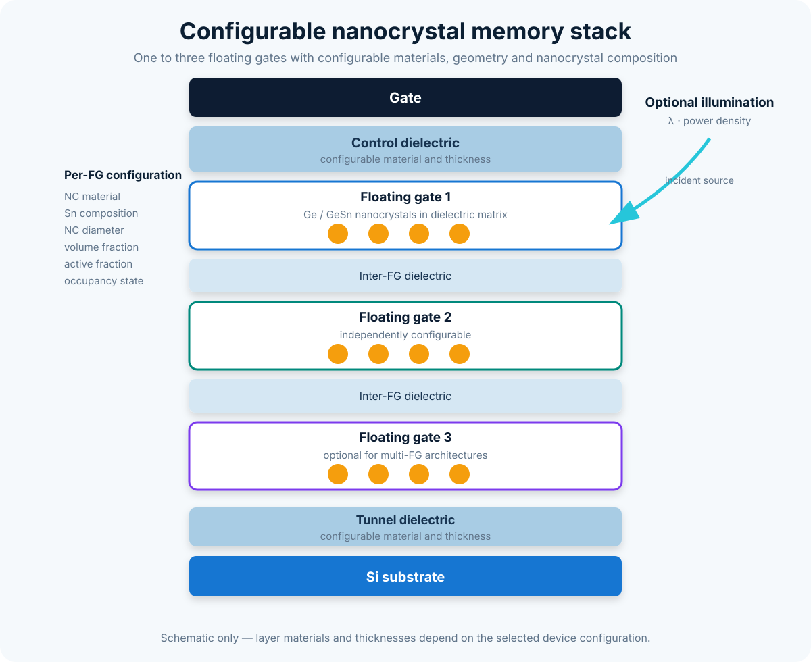

# Device and state model

## Ordered layer stack

A device is represented by `ncmemsim.Device`, which owns an ordered list of `Layer` and `FloatingGateLayer` objects. Each layer stores its physical thickness and role. The ordering defines the one-dimensional coordinate used by the electrostatic and transport engines.

`Device.validate()` is called by `Simulator` construction and rejects inconsistent stacks before a simulation begins.

## Floating-gate layer

`FloatingGateLayer` extends the generic layer description with the discretization and nanocrystal parameters required by the occupancy model. The number of grid points may differ between FGs, so each FG can be independently resolved.

The helper `DeviceBuilder` provides reproducible architecture construction, while direct layer construction remains available for non-standard stacks.

## Device state

`DeviceState` contains one `FloatingGateState` per physical FG. The association is traceable through:

- `fg_id`;
- `layer_name`;
- `z_center_nm`;
- optional local field and potential values;
- a metadata dictionary.

A state can be initialized with:

```python
from ncmemsim import DeviceState

state = DeviceState.empty_for_device(device)
```

This creates an initially empty occupation distribution, with `P0 = 1` and `P1 = P2 = 0` at every grid point.

## Validation invariants

`FloatingGateState.validate()` checks that:

- `P0`, `P1`, and `P2` have identical one-dimensional shapes;
- all values are finite and non-negative;
- the probabilities sum to unity within tolerance;
- FG identifiers are non-negative.

`DeviceState.validate(device)` additionally checks:

- the number of state objects equals the number of device FGs;
- grid sizes match the corresponding physical layers;
- IDs and layer names are consistent.

## Copy semantics

Both state classes implement deep-copy operations for arrays and metadata containers. Simulation methods therefore return new transient states without silently aliasing the user-provided initial state.

## Charge aggregation

The occupancy engine computes a charge-density distribution for each FG. The simulator integrates each distribution to obtain

\[
Q_{\mathrm{FG},i}\quad [\mathrm{C\,m^{-2}}]
\]

and the total sheet charge

\[
Q_{\mathrm{FG}}=\sum_i Q_{\mathrm{FG},i}.
\]

Per-FG and aggregate values are both retained in simulation outputs so that multi-FG effects are not hidden by a single scalar.


## Supported stack families



The drawing is schematic and not to scale. Layer dimensions and floating-gate parameters are supplied by the device configuration.
