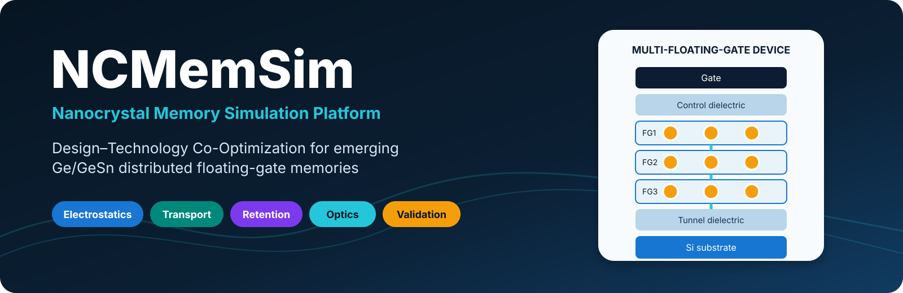

# NCMemSim

**NCMemSim** is a modular compact multiphysics platform for distributed
floating-gate nanocrystal memories based on Ge, GeSn, and high-k dielectric
stacks.

NCMemSim v0.10.0 extends the validated electrical kernel with
wavelength-dependent optical absorption, photo-assisted charge-state
transitions, and electro-optical programming.

The platform supports one to three floating gates, local one-dimensional
electrostatics, compact WKB transport, charge redistribution, retention
simulation, deterministic regression references, reproducibility metadata,
and compact Ge/GeSn optical programming models.

## Start here

- New users: [Installation](installation.md) and [Quick start](quickstart.md)
- Researchers: [Scientific scope and assumptions](scientific_scope.md)
- Optical modelling: [Optical programming](optics.md)
- Model developers: [Software architecture](architecture.md) and [Developer guide](developer.md)
- Reproducibility: [Validation](validation.md) and [Reproducibility and benchmarking](reproducibility.md)

## Model map

```text
Device and materials
        ↓
State initialization: P0, P1, P2 for each FG
        ↓
Electrostatics and local field profile
        ↓
Occupancy kinetics + WKB transport
        ↓
Optional optical absorption + photo-assisted transitions
        ↓
Conservative inter-FG redistribution
        ↓
C-V, transient, retention, and electro-optical outputs
        ↓
Validation, golden references, benchmarks, manifest
```

## Scientific positioning

NCMemSim is intended for mechanism studies and DTCO, not as a full
multidimensional TCAD replacement.

Its value lies in explicit assumptions, modular physics, transparent per-FG
state variables, deterministic regression testing, and a workflow that can be
calibrated against experiment.

### Current status

The v0.10.0 release completes the Phase E optical-programming
extension.

The Phase D electrical framework includes:

- multi-floating-gate state dynamics;
- electrostatic coupling;
- local field profiles;
- inter-FG transport;
- retention;
- validation;
- golden-reference regression;
- benchmarking;
- reproducibility support.

Phase E adds:

- monochromatic optical sources;
- wavelength-dependent Ge/GeSn optical response;
- direct-Gamma absorption;
- indirect phonon-assisted absorption;
- Urbach-tail absorption;
- Beer-Lambert floating-gate absorption;
- absorbed photon flux and generation;
- photo-assisted 0 -> 1 and 1 -> 2 transitions;
- combined electrical and optical programming;
- optical support in relaxation, voltage sweeps, and C-V simulation;
- SWIR wavelength and programming benchmarks;
- SWIR programming-voltage-reduction validation.

The current automated suite contains **194 tests** and passes locally on
Python 3.13.12.

Regression against the retained V5.3 electrical reference remains part of the
validation suite. The legacy timestep inconsistency identified during v0.9.1
release validation remains corrected and covered by regression testing.

The v0.10.0 optical model is a compact physics model. Absolute optical
absorption amplitudes and photo-capture efficiencies are not yet experimentally
calibrated, and the current implementation does not include effects such as
Franz-Keldysh absorption, Stark shifts, state filling, explicit
strain-dependent absorption, nanocrystal quantum-confinement corrections, or
sequential optical attenuation through multiple floating gates.
