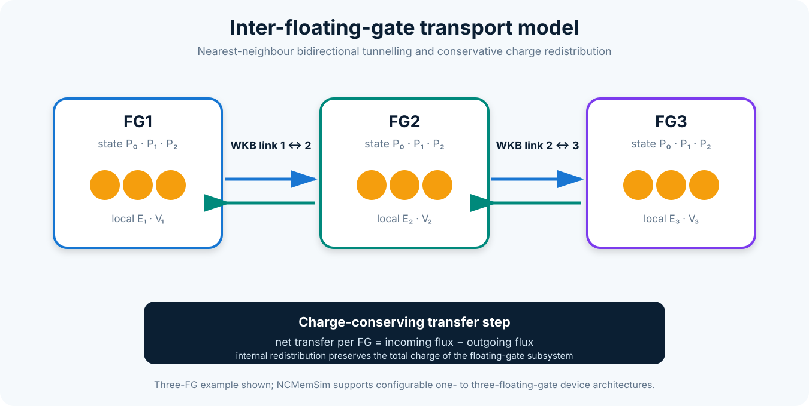

# Transport and retention

## Transport graph

The transport layer represents the device as nodes and links:

- `TransportNode` identifies a substrate or FG node;
- `TunnelLink` connects adjacent nodes;
- `TunnelNetwork` stores the ordered graph;
- `TransportEngine` evaluates transmissions and electron fluxes.

`NodeKind` distinguishes physical node types. The current multi-FG model creates nearest-neighbour FG-to-FG links. Substrate exchange remains governed by the occupancy kinetics engine, while substrate links may be retained for diagnostics.

## WKB transmission

For a one-dimensional barrier, the compact engine evaluates a WKB-type transmission

\[
T\approx\exp\!\left[-2\int_{z_1}^{z_2}\kappa(z)\,\mathrm{d}z\right],
\]

with

\[
\kappa(z)=\frac{\sqrt{2m^*\left(U(z)-E\right)}}{\hbar}
\]

inside the classically forbidden region. Barrier parameters are supplied through material and tunnelling configurations.

The current implementation is suitable for comparative compact modelling; it is not a full transfer-matrix, NEGF, or Schrödinger–Poisson solver.

## Conservative FG-to-FG transfer

At each transport step, the engine evaluates link fluxes and converts them into bounded changes of the linked FG occupations. Transfers are rebalanced when clipping is required so that internal redistribution does not create or destroy charge numerically.

The result exposes:

- link identifiers;
- per-link transmission;
- inter-FG flux in m⁻² s⁻¹;
- net electron flux for every FG;
- detailed `LinkTransportResult` objects.

The validation layer can test internal charge conservation independently of injection or emission to the substrate.

## Occupancy kinetics

`OccupancyEngine` evolves the three-state probabilities using rate arrays for program and erase processes. The kinetic state remains normalized after every update. In a multi-FG device, each FG receives its own local electrostatic conditions and rate arrays.

## Voltage relaxation

`Simulator.relax_voltage()` subdivides the requested dwell interval into internal time steps. Each step follows the coupled sequence:

1. compute per-FG charge;
2. evaluate electrostatics and local fields;
3. evaluate and apply occupancy kinetics;
4. evaluate conservative inter-FG redistribution;
5. update the transient state.

The final state is then re-evaluated to provide self-consistent diagnostic outputs.

## Retention solver

`RetentionSolver` integrates the coupled system at a fixed retention bias, commonly zero volts. `RetentionConfig` controls:

- final simulation time;
- initial and maximum time step;
- geometric time-step growth;
- logarithmic output spacing;
- optional quasi-equilibrium stopping criteria.

`RetentionResult` retains time histories of total and per-FG charge, occupations, electrostatic quantities, and transport diagnostics. Convenience metrics include total charge-retention fraction and charge-loss fraction.

## Interpreting retention predictions

Long-time extrapolation is highly sensitive to barrier height, effective mass, local field, active nanocrystal density, and the included emission mechanisms. Retention predictions should therefore be accompanied by parameter provenance and sensitivity analysis rather than presented as parameter-free forecasts.

## Transport-network schematic

Bidirectional nearest-neighbour links are evaluated from local electrostatic conditions and applied through a conservative transfer step.
