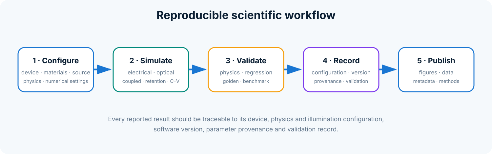

# Scientific workflows

## 1. Build and validate a device

```python
from ncmemsim import DeviceBuilder

# Select a supported builder method or construct an explicit layer stack.
device = DeviceBuilder.v2(number_of_fgs=2)
device.validate()
```

The exact builder signatures are documented in the public API and executable examples. For custom research stacks, construct the ordered layers directly and validate the result before simulation.

## 2. Initialize a traceable state

```python
from ncmemsim import DeviceState

state = DeviceState.empty_for_device(device)
state.validate(device)
```

The state now contains one independent probability distribution for every FG.

## 3. Relax at one voltage

```python
from ncmemsim import Simulator

simulator = Simulator(device)
result = simulator.relax_voltage(state, gate_voltage_V=3.0)

print(result["qfg_by_fg_C_m2"])
print(result["electrostatic_local_field_by_fg_V_m"])
```

Use a copied or returned state for subsequent voltage points; do not manually reuse mutable arrays without validation.

## 4. Run a C–V cycle

The simulator supports forward and backward voltage sweeps and returns `CVResult`, containing both sweep objects and the extracted memory window. Per-FG arrays remain available inside each `SweepResult`.

See the executable scripts in `examples/` for the authoritative calling patterns of the current release.

## 5. Simulate retention

Create a `RetentionConfig`, initialize the programmed state, and use `RetentionSolver`. Inspect both total charge retention and per-FG redistribution: a nearly constant total charge can coexist with substantial internal transfer between floating gates.

## 6. Validate the output

```python
from ncmemsim import validate_simulation

report = validate_simulation(device, result)
for issue in report.issues:
    print(issue.severity, issue.message)
```

Validation should be included in automated parameter sweeps so that non-physical configurations are identified rather than averaged into the results.

## 7. Record provenance

```python
from ncmemsim import build_reproducibility_manifest

manifest = build_reproducibility_manifest(device=device)
```

Store the manifest next to exported arrays, plots, and fit parameters.

## 8. Suggested publication workflow

For a figure or table intended for publication:

1. keep the input configuration under version control;
2. run unit and validation checks;
3. create the reproducibility manifest;
4. export raw numerical data before plotting;
5. record the script and Git commit that generated the figure;
6. avoid replacing golden references during routine figure generation;
7. report calibrated and assumed parameters separately.


## Workflow diagram


